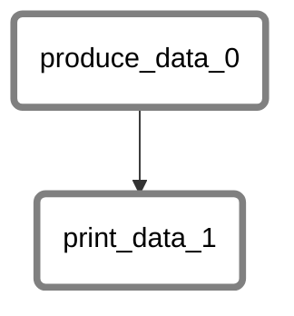
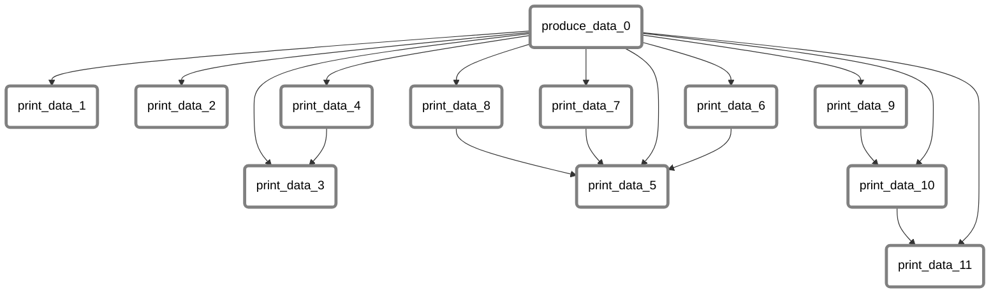
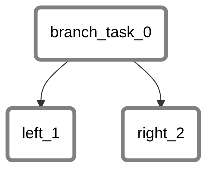

<h1 align=center>thepipelinetool</h1>
<!-- <h4 align="center"></h4> -->

<div align="center">
  <a href="https://github.com/thepipelinetool/thepipelinetool/releases" target="_blank">
    
  </a>
  <a href="https://crates.io/crates/thepipelinetool" target="_blank">
    
  </a>
  <a href="https://github.com/thepipelinetool/thepipelinetool/actions/workflows/examples.yml" target="_blank">
    
  </a>
</div>

</br>

`thepipelinetool` organizes your Rust functions into a [Directed Acyclic Graph](https://en.wikipedia.org/wiki/Directed_acyclic_graph) (DAG) structure, ensuring orderly execution according to their dependencies. The DAG is compiled into a CLI executable, which can then be used to list tasks/edges, run individual functions, and execute locally. Finally, deploy to [thepipelinetool_server](https://github.com/thepipelinetool/thepipelinetool_server) to enjoy scheduling, catchup, retries, and live task monitoring with a modern web UI.

## Features
- *Easy Usage* - Simply write normal rust code and let `thepipelinetool` handle execution order, concurrent execution, timeouts, and retries
- *Special Tasks* - Create multiple [Dynamic](#dynamic-tasks) tasks from upstream results or a control flow using [Branching](#branching-tasks) tasks
- *Safety and Reliability* - Rust's compile-time checks ensure code safety and prevent common bugs

## Contents
- [Installation](#installation)
- [Usage](#usage)
- [Documentation](#documentation)
- [Examples](#examples)
  - [Simple DAG](#simple-dag)  
  - [Manually Defining Depencencies](#manually-defining-depencencies)
  - [Branching Tasks](#branching-tasks)
  - [Dynamic Tasks](#dynamic-tasks)
  - [More Examples](#more-examples)
- [Deployment](#deployment)

## Installation
Get started by cloning the [template](https://github.com/thepipelinetool/thepipelinetool_template) project
```bash
git clone https://github.com/thepipelinetool/thepipelinetool_template
```

Or create a new project and add `thepipelinetool` dependency
```bash
mkdir your_dag_name
cd your_dag_name
cargo init --bin
cargo add thepipelinetool
```
Add the following to `src/main`
```rust 
use thepipelinetool::prelude::*;

#[dag]
fn main() {
    // define your tasks here
}
```

Run the complete DAG in memory:
```bash
cargo run your_dag_name run in_memory
```

## Usage
```
cargo run --release your_dag_name <COMMAND>

Commands:
  describe  Describes the DAG
  tasks     Displays tasks as JSON
  edges     Displays edges as JSON
  hash      Displays hash as JSON
  graph     Displays graph
  tree      Displays tree
  run       Run complete DAG or function by name
  help      Print this message or the help of the given subcommand(s)

Options:
  -h, --help     Print help
  -V, --version  Print version
```
## Documentation
- Find the latest docs [here](https://docs.rs/thepipelinetool/latest/thepipelinetool/)

## Examples
### Simple DAG
```rust
use thepipelinetool::prelude::*;

fn produce_data(_: ()) -> String {
    "world".to_string()
}

fn print_data(arg: String) -> () {
    println!("hello {arg}");
}

#[dag]
fn main() {
    let opts = &TaskOptions::default();

    // add a task that uses the function 'produce_data'
    let task_ref = add_task(produce_data, (), opts);

    // add a task that depends on 'produce_data'
    let _ = add_task_with_ref(print_data, &task_ref, opts);
}
```


----
### Manually Defining Depencencies
```rust
use thepipelinetool::prelude::*;

fn produce_data(_: ()) -> String {
    "world".to_string()
}

fn print_data(arg: String) -> () {
    println!("hello {arg}");
}

#[dag]
fn main() {
    let opts = &TaskOptions::default();
    let task_ref = add_task(produce_data, (), opts);

    // these tasks will execute in parallel
    let _task_ref1 = add_task_with_ref(print_data, &task_ref, opts);
    let _task_ref2 = add_task_with_ref(print_data, &task_ref, opts);

    // declare downstream dependencies using right-shift operator '>>'
    let task_ref3 = add_task_with_ref(print_data, &task_ref, opts);
    let task_ref4 = add_task_with_ref(print_data, &task_ref, opts);
    let _ = task_ref4 >> task_ref3; // run task4 before task3

    // declare upstream dependencies using left-shift operator '<<'
    let task_ref5 = add_task_with_ref(print_data, &task_ref, opts);
    let task_ref6 = add_task_with_ref(print_data, &task_ref, opts);
    let _ = &task_ref5 << task_ref6; // run task6 before task5

    // declare parallel tasks using bitwise-or operator '|'
    let task_ref7 = add_task_with_ref(print_data, &task_ref, opts);
    let task_ref8 = add_task_with_ref(print_data, &task_ref, opts);
    let parallel_task_ref = task_ref7 | task_ref8; // run task7 and task8 in parallel

    // use previous results for further dependency declaration
    let _ = parallel_task_ref >> task_ref5;

    // chaining
    let task_ref9 = add_task_with_ref(print_data, &task_ref, opts);
    let task_ref10 = add_task_with_ref(print_data, &task_ref, opts);
    let task_ref11 = add_task_with_ref(print_data, &task_ref, opts);
    
    let _ = task_ref9 >> task_ref10 >> task_ref11;
    // the result of taskA >> taskB is taskB, so the above is equivalent to:
    // ((task_ref9 >> task_ref10) >> task_ref11)
}
```

----
### Branching Tasks
```rust
use thepipelinetool::prelude::*;

fn branch_task(_: ()) -> Branch<usize> {
    Branch::Left(0)
}

fn left(arg: usize) -> () {
    println!("left {arg}");
}

fn right(_: usize) -> () {
    println!("this won't execute");
}

#[dag]
fn main() {
    // only 'left' task will be executed since branch_task returns Branch::Left
    let _ = branch(branch_task, (), left, right, &TaskOptions::default());
}
```

----
### Dynamic Tasks
```rust
use thepipelinetool::prelude::*;

fn produce_lazy(_: ()) -> Vec<u8> {
    vec![0, 1]
}

fn say_hello(arg: u8) -> u8 {
    println!("hello {arg}");
    arg
}

#[dag]
fn main() {
    let opts = &TaskOptions::default();

    let produce_lazy_task_ref = add_task(produce_lazy, (), opts);

    // creates a new task for each item in 'produce_lazy' result
    let expanded_lazy_task_ref = expand_lazy(say_hello, &produce_lazy_task_ref, opts);

    // you can also chain lazily expanded tasks
    let _ = expand_lazy(say_hello, &expanded_lazy_task_ref, opts);
}
```
----
### More Examples
Find more examples [here](https://github.com/thepipelinetool/thepipelinetool/tree/main/thepipelinetool/examples)

## Deployment
To deploy DAGs, the compiled binaries must be placed inside `DAGS_DIR` for both the server and workers to access.
Visit the [template](https://github.com/thepipelinetool/thepipelinetool_template) project for the docker-compose.yml example

## License
AGPLv3
